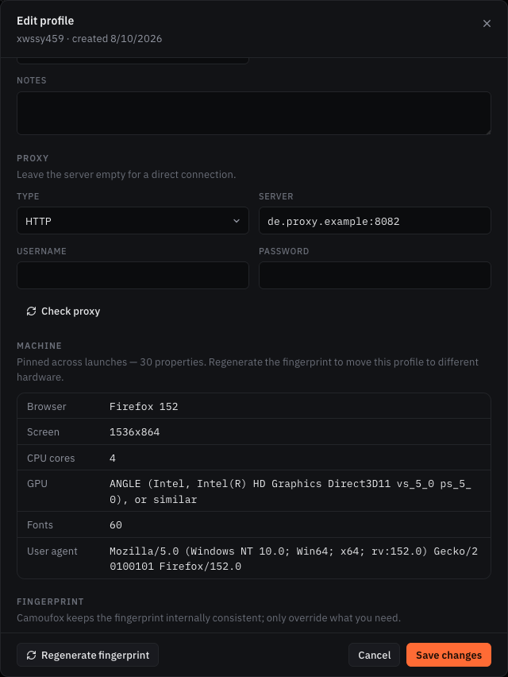
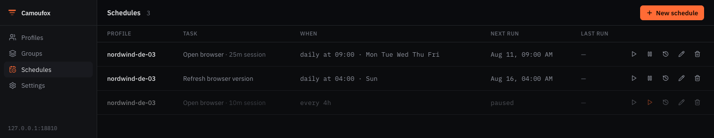
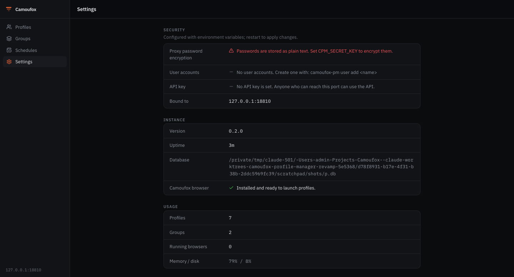

# Fingerprint Lite

[](https://github.com/xinian5216/fingerprint-lite/actions/workflows/ci.yml)
[](LICENSE)
[](https://www.python.org/downloads/)
[](https://github.com/daijro/camoufox)

A local profile manager built on the upstream [Camoufox](https://github.com/daijro/camoufox)
browser project. Fingerprint Lite keeps profile data and browser state on your
machine and provides a desktop-first way to manage separate browser profiles.

Each profile is **one long-lived machine**. It keeps the same fingerprint every
session, along with its own cookies, storage and history, so an account opened
from it in January still looks like the same computer in June.

> **Status:** `v0.1.0-alpha.1` — an early pre-release for evaluation, targeting
> Windows 10/11 x64. It supports local profiles with pinned fingerprints, HTTP
> proxies with authentication, SOCKS5 without authentication, custom Data/Browser/
> Temp paths, online/offline Camoufox installation, and profile archive backup
> and restore. See [CHANGELOG.md](CHANGELOG.md) for limitations. This software does
> not promise undetectability or complete anonymity.


## What it does

- **A profile is the same machine every launch.** Camoufox generates a fresh
  fingerprint on every start, which is right for a privacy tool and wrong for a
  long-lived account. The first launch resolves the fingerprint once and stores
  it; every launch after replays it. Location, timezone and WebRTC stay dynamic
  so they keep following the proxy. See
  [docs/profile-settings.md](docs/profile-settings.md).
- **Real device fingerprints.** Create a profile from one of the 312 fingerprints
  Camoufox captured from actual machines, instead of a synthetic one.
- **Profiles** — create, edit, clone, delete, search, filter, and use bulk
  actions. A clone gets its own machine by default: two profiles sharing one
  fingerprint are provably one computer.
- **Browser control** — launch and stop a browser per profile; closing the window
  yourself is noticed and the session is cleaned up.
- **Scheduling** — open a profile on a schedule (warming), and keep its pinned
  browser version current automatically. Hardware never rotates on a timer, on
  purpose — [docs/scheduling.md](docs/scheduling.md).
- **Proxies, checked before you trust them.** HTTP/HTTPS proxies support
  authentication; SOCKS5 is supported without credentials. SOCKS5 credentials are
  not supported. HTTP proxy passwords are encrypted at rest when `CPM_SECRET_KEY` is set. *Check proxy* reports
  where the proxy really comes out and whether the profile agrees with it — a
  timezone on a different clock from the exit country is the kind of
  contradiction a page can measure in two lines of JavaScript. The answer stays
  in the profiles list — exit address, country and latency under the proxy, green
  or amber or red — and a selection can be checked in one go.
- **Multi-user, when you need it.** Nothing to configure for the usual case: the
  app binds to loopback and is open. Set `CPM_API_KEY` for machine clients, or
  create an account (`camoufox-pm user add`) and humans get a login screen —
  argon2id hashes, HttpOnly session cookies, a logout that really invalidates.
- **Move a profile anywhere.** Export a profile with its fingerprint *and* its
  browser data into one archive, and import it on another machine.
- **REST API and web UI**, served on one port from one process.

## What it looks like

<table>
<tr>
<td width="50%"></td>
<td width="50%">

**The pinned machine.** This is the part that makes a profile an account rather
than a browser window. Every value here was resolved once and is replayed on
every launch — the screen, the CPU count, the GPU string, the font set, the user
agent. *Regenerate* moves the profile to different hardware, deliberately, and
tells you what that costs.

The profile above is pinned to one of the 312 devices Camoufox captured from real
machines, so the combination is one that actually exists rather than an assembly
of plausible parts.

</td>
</tr>
</table>

| Scheduled work | System settings |
| --- | --- |
|  |  |
| Warming launches and browser-version refreshes. Hardware never rotates on a timer — [why](docs/scheduling.md). | Reports the effective configuration and warns when proxy passwords are unencrypted or the API is open. |

## Install and run

You need [uv](https://docs.astral.sh/uv/) and Python 3.10+. Node.js 20.9+ is only
needed if you build the web UI yourself.

### Windows portable Alpha

The prepared Windows package is named
`FingerprintLite-0.1.0-alpha.1-windows-x64.zip`. No GitHub Release or PyPI
distribution has been published from this branch; do not use releases from the
upstream Camoufox Profile Manager project as Fingerprint Lite packages.

### From source

```bash
git clone https://github.com/xinian5216/fingerprint-lite.git
cd fingerprint-lite
uv sync
uv run camoufox fetch
uv run python scripts/build_webui.py    # builds the UI into the package (needs Node)
uv run camoufox-pm
```

`camoufox-pm` opens your browser automatically. The UI is served from the same
origin as the API, so there is no proxy or CORS to configure. Full options in
[docs/cli.md](docs/cli.md).

### As a desktop window

```bash
uv sync --extra desktop
uv run camoufox-pm --desktop
```

Or build a standalone app that needs neither Python nor Node:
`python scripts/build_desktop.py`.

### As a portable Windows app

`python scripts/build_portable.py` produces
`dist/FingerprintLite-<version>-windows-x64.zip`. Unzip it anywhere and
double-click `FingerprintLite.exe` — no Python, no Node, no installation.
Profiles, database, config and logs live in the `Data` folder beside the
program, so the folder can be moved or backed up as one unit. The first run
fetches the fixed, SHA256-verified Camoufox browser build; an official ZIP
dropped into `Browser` installs it offline instead. Details in
[docs/cli.md](docs/cli.md).

### With Docker

```bash
docker compose up      # then open http://localhost:8000
```

One container serving the API and the UI on one port, like every other way of
running it. The port is published on loopback only. Launching real browsers
inside a container needs a virtual display; profile management, scheduling and
the UI work as-is.

## First steps

1. Open the app and click **New profile**.
2. Pick an operating system, and optionally a **real device** to pin the profile
   to. Leave the fingerprint fields blank and Camoufox generates a consistent set.
3. Add a proxy if you have one. Use HTTP/HTTPS for authenticated proxies;
   authenticated SOCKS5 is not supported.
4. Press **Run**. The row shows the profile as running until you stop it or close
   the browser yourself.

The **Settings** screen reports how the instance is configured and warns if proxy
passwords are unencrypted or the API is reachable without a key.

## Configuration

Settings come from environment variables (prefix `CPM_`). Copy `.env.example` to
`.env` and edit as needed.

| Variable           | Default                 | Description                                     |
| ------------------ | ----------------------- | ----------------------------------------------- |
| `CPM_HOST`         | `127.0.0.1`             | Bind address                                    |
| `CPM_PORT`         | `8000`                  | Port                                            |
| `CPM_DB_PATH`      | `data/profiles.db`      | SQLite database path                            |
| `CPM_LEASE_TTL`    | `120`                   | Seconds a profile's lease survives without a heartbeat — how long a crashed instance keeps its profiles locked. Minimum 60 |
| `CPM_SECRET_KEY`   | *(empty)*               | Fernet key; encrypts proxy passwords at rest    |
| `CPM_API_KEY`      | *(empty)*               | If set, required as the `X-API-Key` header (machine clients) |
| `CPM_SESSION_TTL_HOURS` | `168`              | Login session lifetime, in hours                |
| `CPM_SECURE_COOKIES` | `0`                   | Force the session cookie's `Secure` flag (set behind a TLS proxy) |
| `CPM_CORS_ORIGINS` | `http://localhost:3000` | Comma-separated allowed origins                 |
| `CPM_WEBUI_DIR`    | *(auto)*                | Override where the bundled web UI is served from |

Generate an encryption key with:

```bash
uv run python -c "from cryptography.fernet import Fernet; print(Fernet.generate_key().decode())"
```

User accounts for the web UI are managed from the CLI: `camoufox-pm user add
<name>` creates one, and from then on the API and UI require a login (see
[SECURITY.md](SECURITY.md#authentication)).

### Running more than one instance

Two instances against one database — the web UI and a CLI launch on the same
machine, or two machines sharing a database file — must not open the same
profile at once. One identity in two browsers means one cookie jar written from
two places and the same account live from two IPs, which is exactly the
correlation a profile exists to avoid.

Each launch therefore takes a **lease** on the profile, and a second instance is
refused (`409` over the API) until the browser closes. A lease is renewed while
the browser runs and expires `CPM_LEASE_TTL` seconds after an instance stops
renewing, so a machine that died does not lock its profiles forever.

```bash
camoufox-pm leases          # who holds what
camoufox-pm unlock <id>     # force-release, after checking the holder is gone
```

Force-release is CLI-only by design: it is the one operation that can put two
browsers on one identity, so it takes shell access to the host rather than a
button in the UI.

Editing is protected separately, because a profile is usually edited while
nobody is running it. Each save carries the version it was based on, so two
people editing the same profile no longer overwrite each other: the second save
is refused, and the web UI says what changed and lets you apply your version
deliberately rather than losing either edit.

Sharing the database file itself is safe between processes on one machine.
Across machines it needs a filesystem whose locking SQLite can trust — which
rules out most NFS and SMB mounts, where a lease may be read as free while
another host holds it.

## Documentation

| Document | What it covers |
| -------- | -------------- |
| [docs/cli.md](docs/cli.md) | Every command and flag |
| [docs/api.md](docs/api.md) | The REST API, endpoint by endpoint |
| [docs/profile-settings.md](docs/profile-settings.md) | What each setting does, how the pinned machine works, and what Camoufox cannot do |
| [docs/scheduling.md](docs/scheduling.md) | Scheduled launches and browser refresh, and why hardware rotation is not offered |
| [docs/accessibility-roadmap.md](docs/accessibility-roadmap.md) | Plan for reaching non-technical users |
| [docs/releasing.md](docs/releasing.md) | Cutting a release |
| [docs/signing.md](docs/signing.md) | Code-signing the desktop builds |
| [docs/roadmap.md](docs/roadmap.md) | What is planned |
| [CONTRIBUTING.md](CONTRIBUTING.md) | Working on the project |
| [SECURITY.md](SECURITY.md) | Reporting a vulnerability |

## Measured, not assumed

Every claim above was checked against a running browser, and several of them
turned out differently than expected. The measurements are in the repository, as
tests that fail if the behaviour changes:

| What was measured | Result |
| --- | --- |
| Does an unpinned profile keep its hardware between launches? | **No.** The same profile reported 1600x900 then 3440x1440, 12 then 32 CPU cores, an NVIDIA then an AMD GPU. This is why pinning exists. |
| Is the canvas stable for a site across sessions? | **No, by default** — it is stable within a session and per site, and changes on the next launch. `stable_canvas` fixes that, at the cost of being identical across sites. Both are asserted in [browser tests](tests/browser/test_fingerprint_stability.py). |
| Does Camoufox's `canvas:seed` property work? | **No.** It is declared and passed through, and nothing reads it. Reported upstream as [daijro/camoufox#721](https://github.com/daijro/camoufox/issues/721) with a reproduction. |
| What happens if a profile sets coordinates? | Camoufox's IP lookup switches off, and Firefox then reports **the host machine's own timezone** — a real leak, found by reading the clock in a live browser. Fixed by filling that in ourselves. |

The same discipline applies to the code: cleanup that could delete every profile
directory, clones that shared a fingerprint with their source, and a release that
reported the wrong version were all found by running the thing, not by reading
it. See [CHANGELOG.md](CHANGELOG.md).

## Architecture

```
src/camoufox_pm/
├── main.py             FastAPI app; serves the API and the bundled UI
├── cli.py              the camoufox-pm command, including user accounts
├── config.py           environment-based settings
├── core/
│   ├── models.py            profiles, groups, browser settings, schedules
│   ├── database.py          SQLite storage and migrations
│   ├── profile_manager.py   profile lifecycle and browser control
│   ├── browser_session.py   running browsers
│   ├── fingerprint_store.py pinning, refreshing, and the real device presets
│   ├── fingerprint_generator.py  the high-level constraints a new profile starts from
│   ├── proxy_check.py       where a proxy exits, and whether the profile agrees
│   ├── scheduler.py         scheduled launches and browser refreshes
│   ├── profile_archive.py   whole-profile export and import
│   ├── auth.py              password hashing and login sessions
│   ├── crypto.py            proxy-password encryption at rest
│   └── cleanup.py           finding and removing orphaned profile directories
└── api/                routes, models, error shape, middleware
web/                    Next.js web interface
```

**Backend:** Python, FastAPI, SQLite, Camoufox + Playwright.
**Frontend:** Next.js 16, React 19, TypeScript, Tailwind v4.

## Development

```bash
uv sync --extra dev
uv run ruff check src tests
uv run mypy src/camoufox_pm
uv run pytest -m "not browser"    # fast suite
uv run pytest -m browser          # launches a real browser, needs `camoufox fetch`
```

See [CONTRIBUTING.md](CONTRIBUTING.md).

## Disclaimer

This tool is for lawful use only — for example testing, privacy, and managing
multiple accounts in accordance with each site's terms of service. You are
responsible for how you use it. Antidetect browsing does not make any activity
that would otherwise be against a service's rules acceptable. Fingerprint Lite
does not promise undetectability or complete anonymity. Canvas is not pinned by
default; see the Alpha limitations in [CHANGELOG.md](CHANGELOG.md).

## License

[MIT](LICENSE) © Camoufox Profile Manager Contributors.

Fingerprint Lite preserves its upstream project's MIT license and copyright
notice. See [THIRD-PARTY-NOTICES.md](THIRD-PARTY-NOTICES.md) for the Camoufox
and browser-engine licensing notes. Built on [Camoufox](https://github.com/daijro/camoufox) by daijro.

---

Русская версия: [README.ru.md](README.ru.md).
